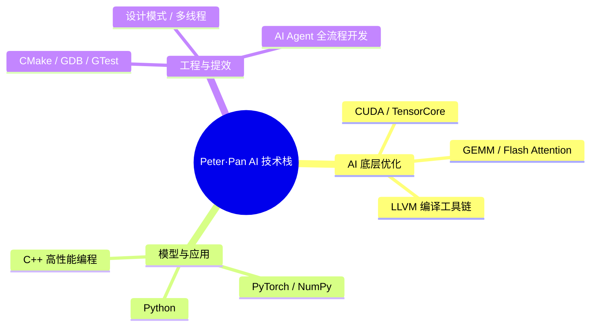

# 👋 大家好，我是 Peter·Pan，一个专注 AI 编程与高性能计算的知识分享者

从 C++ 高性能底层到 CUDA 算子优化，再到 AI Agent 应用开发——  
我热爱把硬核技术拆解为易懂的实践，**帮助更多开发者用好 AI，跑得更快**。

## 🧠 我的 AI & 高性能技术栈
- **AI 底层优化**：精通 CUDA、TensorCore 编程，手写 GEMM、Flash Attention 等高性能算子，熟悉 LLVM 编译工具链，让模型推理飞起来
- **模型与应用**：熟练使用 Python、PyTorch、NumPy，打通算法到工程落地
- **AI 提效实践**：All in AI Agent，用 AI 辅助设计、编码与调试，**开发效率翻倍**；持续分享 AI 工具链与高效工作流
- **工程底盘**：C++/泛型/多线程/设计模式、CMake/GDB/GTest/Pytest 等硬核技能，支撑高质量软件交付

## 🧠 我的技能树

## 📢 在哪里能看到我的分享
- 📘 CSDN：[Peter·Pan爱编程](https://blog.csdn.net/weixin_42125125?spm=1000.2115.3001.5343)  
- 🌐 个人网站：[https://www.peterpanai.com](https://www.peterpanai.com)  
  *定期更新 AI 编程、模型加速、开发工具实战与效率方法论*

## 🛠️ 免费开发者工具推荐
这几个小工具，也是我 AI 开发日常中的趁手利器：

- 🔢 [FloatVisualizer](https://panmcai.github.io/FloatVisualizer/) —— 浮点数精度可视化，量化调试一目了然  
- 🧩 [RegexBox](https://regexbox.panmcai.dpdns.org/) —— 在线正则调试，数据处理文本清洗更顺手  
- 🧹 [FormatFactory](https://panmcai.github.io/FormatFactory/) —— 轻量格式化转换，日志 & 数据预处理快人一步  

> 🌟 关注我，一起用 AI 重构开发效率，做 AI 时代的超级个体！
